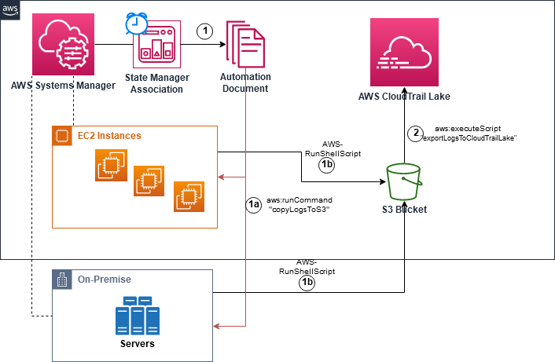
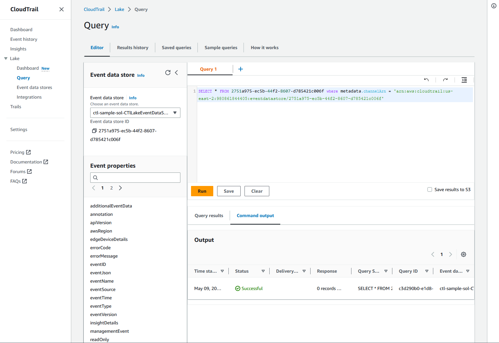

# Blog Post: Automate the Ingesting of event logs from managed nodes into AWS CloudTrail Lake with AWS Systems Manager

**This blog shows how to Automate Ingesting of managed node log events
into CloudTrail Lake with AWS Systems Manager Automation. This blog will
provide a sample solution using AWS System Manager Automation document
that will pull instance logs and deliver them to AWS CloudTrail Lake.
The solution will leverage Systems Manager and the newly released
feature of ingesting of non-AWS events to CloudTrail Lake.**

**Introduction**

[AWS CloudTrail
Lake](https://docs.aws.amazon.com/awscloudtrail/latest/userguide/cloudtrail-lake.html)
is a managed data lake for capturing, storing, accessing, and analyzing
user and API activity on AWS for audit, security, and operational
purposes. You can aggregate and immutably store your activity events,
and run
[SQL-based](https://docs.aws.amazon.com/awscloudtrail/latest/userguide/query-create-edit-query.html)
queries for search and analysis.

On Jan 2023, we released a new feature that expands the capabilities of
AWS CloudTrail Lake by allowing the [ingestion of events from non-AWS
sources](https://aws.amazon.com/about-aws/whats-new/2023/01/aws-cloudtrail-lake-ingestion-activity-events-non-aws-sources/)
,such as on-premises systems or other cloud providers, into CloudTrail
Lake. This new capability opens new possibilities for organizations to
centralize and analyze event logs from various sources in a single
location.

In Linux based systems, /var/log/secure or /var/log/auth.log file
contains security related event logs such as logins, root user actions,
and output from pluggable authentication modules (PAM). Backing up and
storing these logs in secure centralized locations is a security best
practice for organizations.

In this blog post, we will guide you on how to automate the ingestion of
events from Linux-based nodes managed by [AWS Systems
Manager](https://aws.amazon.com/systems-manager/) into CloudTrail Lake,
providing you with a solution that brings significant benefits. By
leveraging an [AWS Systems Manager Automation
Document](https://docs.aws.amazon.com/systems-manager/latest/userguide/systems-manager-automation.html),
we can parse the /var/log/secure file from the nodes managed by AWS
Systems Manager and deliver them to CloudTrail Lake as custom audit
events using the PutAuditEvents API. Additionally, with an [AWS Systems
Manager State
Manager](https://docs.aws.amazon.com/systems-manager/latest/userguide/systems-manager-associations.html),
you can invoke the automation on the managed nodes on a scheduled basis,
providing you with a reliable and consistent approach to event
ingestion.

This solution helps to streamline your event management process, saving
you time and effort while improving the accuracy and efficiency of your
audit trail. In addition, with this knowledge, you will be able to
automate and centralize your event log management process and reduce the
time required to your auditing and security analysis.

By the end of this blog post, you will have a better understanding of
the AWS Systems Manager capabilities and the steps involved in
automating the ingestion of event logs from non-AWS sources into
CloudTrail Lake.

**Solution Overview**



**Prerequisites**

Before we dive into the solution, let's look at the prerequisites that
are required to get started:

1.  An AWS account with access to the AWS Management Console.

2.  Install an [AWS CLI](https://docs.aws.amazon.com/cli/latest/userguide/getting-started-install.html) to deploy the necessary artifacts using [AWS CloudFormation](https://docs.aws.amazon.com/AWSCloudFormation/latest/UserGuide/Welcome.html), Create AWS Systems Manager Document and Create Systems Manager State Manager Association.

3.  EC2 instances and/or On-premise nodes running [Amazon Linux 2](https://aws.amazon.com/amazon-linux-2) OS with [AWS Systems    Manager Agent](https://docs.aws.amazon.com/systems-manager/latest/userguide/ssm-agent.html) installed.

4.  Ensure the Linux hosts have [logrotate](https://linux.die.net/man/8/logrotate) installed to ensure /var/log/secure logs are rotated after being ingested into CloudTrail Lake.

**Here are the steps to set up the solution:**

1. Download the Cloudformation Template required for this solution to your local machine and deploy the CloudFormation Template using AWS CLI command in Step 2.

    https://gitlab.aws.dev/cca-ambassadors/ssmautomation-exportlogeventstocloudtraillake/-/raw/main/CloudFormation-Template/cloudformation.yaml

Alternately, you can deploy the AWS CloudFormation template directly from the AWS Console using the links below.

|AWS Region                |     Link        |
|:------------------------:|:-----------:|
|us-east-1 (N. Virginia)    | [](https://console.aws.amazon.com/cloudformation/home?region=us-east-1#/stacks/new?stackName=aws-sample-exportlogeventstoctl&templateURL=https://gitlab.aws.dev/cca-ambassadors/ssmautomation-exportlogeventstocloudtraillake/-/raw/main/CloudFormation-Template/cloudformation.yaml) |
|us-east-2 (Ohio)    | [](https://console.aws.amazon.com/cloudformation/home?region=us-east-2#/stacks/new?stackName=aws-sample-exportlogeventstoctl&templateURL=https://gitlab.aws.dev/cca-ambassadors/ssmautomation-exportlogeventstocloudtraillake/-/raw/main/CloudFormation-Template/cloudformation.yaml) |
|us-west-1 (N. California)    | [](https://console.aws.amazon.com/cloudformation/home?region=us-west-1#/stacks/new?stackName=aws-sample-exportlogeventstoctl&templateURL=https://gitlab.aws.dev/cca-ambassadors/ssmautomation-exportlogeventstocloudtraillake/-/raw/main/CloudFormation-Template/cloudformation.yaml) |
|eu-west-1 (Dublin)    | [](https://console.aws.amazon.com/cloudformation/home?region=eu-west-1#/stacks/new?stackName=aws-sample-exportlogeventstoctl&templateURL=https://gitlab.aws.dev/cca-ambassadors/ssmautomation-exportlogeventstocloudtraillake/-/raw/main/CloudFormation-Template/cloudformation.yaml) |
|ap-northeast-1 (Tokyo)    | [](https://console.aws.amazon.com/cloudformation/home?region=ap-northeast-1#/stacks/new?stackName=aws-sample-exportlogeventstoctl&templateURL=https://gitlab.aws.dev/cca-ambassadors/ssmautomation-exportlogeventstocloudtraillake/-/raw/main/CloudFormation-Template/cloudformation.yaml) |

2.  Using AWS CLI, deploy the required resources for the solution such as IAM Roles, IAM policy, S3 bucket, S3 Bucket Policy using the CloudFormation template downloaded in the previous step.


```bash
aws cloudformation deploy --template-file cloudformation.yaml --stack-name aws-sample-exportlogeventstoctl --capabilities CAPABILITY_NAMED_IAM
```
```bash
Waiting for changeset to be created..

Waiting for stack create/update to complete

Successfully created/updated stack -
```

3.  After the deployment succeeds, run the describe-stacks command to note the IAMRoleForInstance name from the outputs, which are required in the subsequent steps.

```bash
aws cloudformation describe-stacks --stack-name aws-sample-exportlogeventstoctl
```
```bash
{
    "Stacks": [
        {
            "StackId": "arn:aws:cloudformation:us-east-2:123456789012:stack/aws-sample-exportlogeventstoctl/bbe9bbd0-e2ec-11ed-9599-0abc498bf4af",
            "StackName": "aws-sample-exportlogeventstoctl",
            "ChangeSetId": "arn:aws:cloudformation:us-east-2:123456789012:changeSet/awscli-cloudformation-package-deploy-1682374190/37a193df-d36b-415f-9e3d-a52e53c1b818",
            "Description": "**WARNING** This AWS CloudFormation StackSets template is part of SSM Automation Sample to export log events to CloudTrail Lake. It creates a CloudTrail EventDataStore, CloudTrail Lake Channel, SSM Document, SSM Association, S3 Bucket, IAM Roles and IAM policies required for the Solution. You will be billed for the AWS resources used if you create a stack from this template.\n",
            "CreationTime": "2023-04-24T22:09:51.280000+00:00",
            "LastUpdatedTime": "2023-04-24T22:09:56.830000+00:00",
            "RollbackConfiguration": {},
            "StackStatus": "CREATE_COMPLETE",
            "DisableRollback": false,
            "NotificationARNs": [],
            "Capabilities": [
                "CAPABILITY_NAMED_IAM"
            ],
            "Outputs": [
                {
                    "OutputKey": "AutomationAssumeRole",
                    "OutputValue": "arn:aws:iam::123456789012:role/aws-sample-exportlogeventstoctl-IAMRole-KUG0MK1TOSM7",
                    "Description": "AutomationAssumeRole ARN"
                },
                {
                    "OutputKey": "SSMAssociation",
                    "OutputValue": "3544302d-cd28-4dec-bde3-09c15e5d1fe1",
                    "Description": "SSM Association"
                },
                {
                    "OutputKey": "CTLakeChannel",
                    "OutputValue": "arn:aws:cloudtrail:us-east-2:123456789012:channel/2df7bb17-cbc9-4fae-b17a-5c80d7e112b5",
                    "Description": "CloudTrail Lake Event Data Store"
                },
                {
                    "OutputKey": "IAMInstanceProfile",
                    "OutputValue": "aws-sample-exportlogeventstoctl-IAMRoleForInstance-18YOZHSNW7JJ8",
                    "Description": "Instance Profile for Managed Nodes"
                },
                {
                    "OutputKey": "IAMRoleForInstance",
                    "OutputValue": "aws-sample-exportlogeventstoctl-IAMRoleForInstance-18YOZHSNW7JJ8",
                    "Description": "Instance Role for Managed Nodes"
                },
                {
                    "OutputKey": "TempS3Bucket",
                    "OutputValue": "aws-sample-exportlogeventstoctl-s3bucket-ikij87gq84t",
                    "Description": "Name of the temporary bucket to store logs"
                },
                {
                    "OutputKey": "SSMDocument",
                    "OutputValue": "SSMDocument-8rXM8OSLkW55",
                    "Description": "SSM Document"
                },
                {
                    "OutputKey": "CTLakeEventDataStore",
                    "OutputValue": "arn:aws:cloudtrail:us-east-2:123456789012:eventdatastore/2df2ada5-50c1-4661-a3ef-da2313dd55c2",
                    "Description": "CloudTrail Lake Event Data Store"
                }
            ],
            "Tags": [],
            "EnableTerminationProtection": false,
            "DriftInformation": {
                "StackDriftStatus": "NOT_CHECKED"
            }
        }
    ]
}

```

Now that the necessary AWS Resources for this sample are deployed, we
can target this solution to existing managed nodes by adding the tag
Key=varlogsecurebackup, Value=true.

4.  Tag your EC2 instance using this command.

```bash
aws ec2 create-tags \
    --resources i-1234567890abcdefg \
    --tags 'Key="varlogsecurebackup",Value=true'

```
5.  Run the following command to tag your on-premises managed instances.

```bash
aws ssm add-tags-to-resource \
    --resource-type "ManagedInstance" \
    --resource-id "mi-1234567890abcdefg" \
    --tags "Key= varlogsecurebackup,Value=true"


```
6.  Using AWS CLI, Attach the Systems Manager Instance Profile aws-sample-exportlogeventstoctl-IAMRoleForInstance-18YOZHSNW7JJ8 to the managed nodes where AWS Systems Manager would need to connect and execute the Automation document.

Example:

```bash
aws ec2 associate-iam-instance-profile --iam-instance-profile Name= aws-sample-exportlogeventstoctl-IAMRoleForInstance-18YOZHSNW7JJ8 --instance-id i-1234567890abcdefg
```
```bash
{
    "IamInstanceProfileAssociation": {
        "AssociationId": "iip-assoc-09eeb311eddaa7984",
        "InstanceId": "i-1234567890abcdefg",
        "IamInstanceProfile": {
            "Arn": " aws-sample-exportlogeventstoctl-IAMRoleForInstance-18YOZHSNW7JJ8",
            "Id": "AIPA6IX7L7O2V6KM5KAWS"
        },
        "State": "associating"
    }
}

```
> Refer to <https://repost.aws/knowledge-center/attach-replace-ec2-instance-profile> for additional details on how to attaching instance profiles via console.

**Testing the Solution**

Now that we\'ve deployed the sample solution and targeted managed nodes,
it\'s time to test it to make sure it\'s working as expected.

After the document has completed execution based on the scheduled
expression, you can verify that the logs have been delivered to
CloudTrail Lake by running the following query against the CloudTrail
Lake event data store.

Login to the AWS Console, Navigate to CloudTrail, Lake and Query.
Execute the following query against the CloudTrail Lake event data
store. You will have to replace the values in the query with Event Data
Store ID and Channel ARN from your environment prior to execution.

```
SELECT * FROM 153da6de-d363-4593-abc3-e983475c882f where
metadata.channelArn =
'arn:aws:cloudtrail:us-west-2:123456789012:channel/67c498cb-71f8-4ab3-ba30-317e59aede0a'
```



In addition, If you would like to audit all the 'sudo' activity across
your managed instances you can run the following CloudTrail Lake Query.

```
SELECT * FROM 2df2ada5-50c1-4661-a3ef-da2313dd55c2 where metadata.channelArn =
'arn:aws:cloudtrail:us-west-2:123456789012:channel/67c498cb-71f8-4ab3-ba30-317e59aede0a' and eventData.useridentity.type like '%sudo%'
```

If everything is working as expected, you should see the log events from
the system logs appearing in the CloudTrail Lake Event Data Store.
Congratulations, you\'ve successfully automated the ingestion of events
from non-AWS sources into CloudTrail Lake!

**Customize the Solution**

You can further customize and extend this solution to support your
specific use case, such as, supporting managed nodes running different
operations systems, exporting custom audit log files and different
export schedules.

**Clean Up**

Using AWS CLI, Run the following command to undeploy the Cloudformation
Stack.

```bash
aws cloudformation delete-stack --stack-name aws-sample-exportlogeventstoctl

```
**Conclusion**

In this blog post, we showed you how to automate the ingestion of events
from non-AWS sources into CloudTrail Lake using AWS Systems Manager
Automation Document. By using Systems Manager Automation Documents, we
can automate the ingestion of events from non-AWS sources into
CloudTrail Lake. The document pulls system logs from a non-AWS source
and delivers them to CloudTrail Lake on a periodic basis. This solution
provides a convenient and automated way to centralize and analyze event
logs from a variety of sources in a single location.

However, it\'s important to note that this solution may not be suitable
for every use case, and customization of the Run Document code may be
necessary to meet the specific needs of an organization. Additionally,
it\'s important to ensure that the IAM role used to execute the Run
Document has the appropriate permissions to access CloudTrail and S3
resources.

Overall, this solution offers a valuable tool for organizations looking
to improve their event log management process and streamline
troubleshooting of issues related to AWS resources. With AWS Systems
Manager and CloudTrail Lake, organizations can achieve a more
comprehensive and centralized record of all API calls, events from their
AWS accounts and audit events meeting regulatory compliance
requirements, internal compliance policies and improving resource
management.

For further reading and to learn more about AWS Systems Manager and
CloudTrail Lake, we recommend checking out the official AWS
documentation:

AWS Systems Manager documentation:
<https://aws.amazon.com/systems-manager/>

AWS CloudTrail documentation: <https://aws.amazon.com/cloudtrail/>
